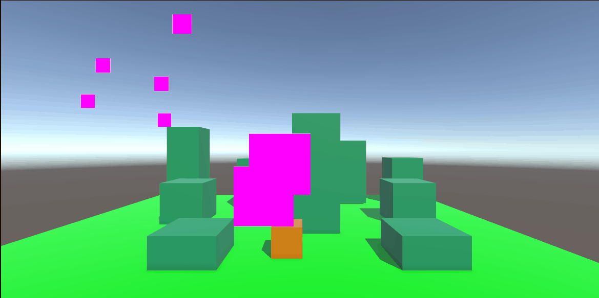

# Tutorial 0

[Script](Assets/Scripts/LaunchCube.cs)
Cube kan springen
# Tutorial 1

[Script](Assets/Scripts/Animate.cs)
ik heb een model geanimeerd
# Tutorial 2

[Script](Assets/Scripts/MoveBasic.cs)
[Script](Assets/Scripts/Animate.cs)
ik kan mijn model bewegen in 3d
# Tutorial 3

[movement](Assets/Scripts/MoveBasic.cs)
de cube kan op platformen springen
# Tutorial 4

[Pickup](Assets/Scripts/GetPickup.cs)
[Score](Assets/Scripts/KeepScore.cs)
[Audio](/Assets/Fx/pickupCoin.wav)
pickup systeem compleet

